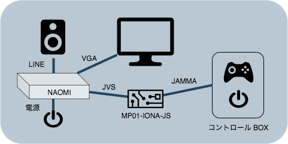
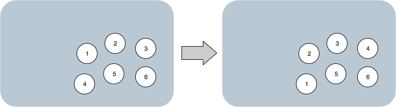

# MP01-IONA-JS (JVS-JAMMA I/O変換基板) サポートページ

## 概要
JVS仕様の基板に旧JAMMA規格のコントローラを接続するための変換基板です。
多くの該当基板では映像や音声はVGAやラインから直接利用できるため、
あくまでコントローラのみの変換になります。
単体で2Pまで対応、他のI/O基板の子機として接続し3P以上に対応する事も可能です。
入力遅延が小さいのが特徴で、確認した環境ではS社製品より2フレーム高速でした。

## 対応機種
SEGA NAOMI、namco SYSTEM12 SYSTEM246/256、TAITO Type X2
といった代表的なシステム基板で動作確認しています。 確認済みタイトルは
[こちら](https://github.com/toyoshim/iona/wiki/Compatibility-Information)
のページで詳しく確認できます。
アナログ入力や銃といった特殊なコントローラを必要とせず、
レバーと6ボタンで対応できるゲームなら動作すると思われます。
互換性リストに載ってないタイトルでの動作実績を確認された方はぜひご連絡下さい。
未対応タイトルがあればファームウェアアップデートで対応したいと思います。

## 接続方法
NAOMIにおける接続例です。NAOMI側の映像、音声、電源は別途接続します。
JVS端子はUSBケーブルを用いてMP01-IONA-JSに接続して下さい。
JVSはコネクタ形状やケーブルはUSBと共通ですが、互換性はないので注意して下さい。
MP01-IONA-JSのJAMMAコネクタにコントロールBOX等を接続して下さい。
JAMMAコネクタは、5V電源の入力、コイン、レバー、ボタンの入力に用いられます。
JAMMAコネクタから電源が供給できない場合は後述する外部電源を利用できます。

## 機能

### 連射機能
変換ボード上で簡易連射機能を備えています。
連射機能をONにするとボタン3から6が連射付きボタン1から3として扱われます。

### ボタン再配置
6ボタン環境で4ボタンを扇状に横一列に並べたい場合に利用できます。

具体的には図のようにボタン1から4を左にローテーションします。

### DIPSW表

| 機能         | 設定 | 1 | 2 | 3 | 4 |   |   |   |   |
|------------- | ---- |---|---|---|---|---|---|---|---|
| 連射         | OFF  |OFF|   |   |   |   |   |   |   |
|              | ON   |ON |   |   |   |   |   |   |   |
| ボタン再配置 | OFF  |   |OFF|   |   |   |   |   |   |
|              | ON   |   |ON |   |   |   |   |   |   |
| 連射速度     | 12   |   |   |OFF|OFF|   |   |   |   |
|              | 15   |   |   |OFF|ON |   |   |   |   |
|              | 20   |   |   |ON |OFF|   |   |   |   |
|              | 30   |   |   |ON |ON |   |   |   |   |

## 拡張

### 外部電源
Q1 (2SA1015)、R2 (1KΩ)、R3 (10KΩ)を実装した上で、
POWERと印字された箇所にある5Vin/GNDを使って5V電源を入力して下さい。
万が一JAMMAからも電源が供給された場合には、JAMMA側が優先されます。
VDD端子は通常は必要ないかと思いますが、
5Vin端子とJAMMAから選択されたマイコン用電源が出力されています。

### 6ボタン対応
JAMMAの規定では最大で5ボタンまでしか対応していませんが、
2種類の拡張方式で6ボタンに対応しています。

1つ目は一部の中華基板に採用されている方式で、
JAMMAのボタン5の隣のGNDを潰してボタン6として出力する方式です。
対応したコントローラを持っている場合は、
1P6、2P6と印字された端子をそれぞれ縦方向の短絡させる事で、
1Pまたは2P向けのボタン6を接続します。
通常のJAMMAでこの配線を行うとボタン6が押されたままの状態になります。

2つ目はKICKハーネス方式です。1P向けのボタン4から6、2P向けのボタン4から6、
そしてGNDを加えた7つの端子がKICKと印字された箇所に用意されています。
KICK端子の対応する信号を接続する事で各種KICKハーネスに対応できます。

### オーディオ/ビデオ パススルー

JAMMA端子から音声や映像を出したい場合、
これらの端子がJAMMAの対応する端子に結線されています。
希望があるようなら将来的にラインや15kHz VGAを入力してJAMMAに出せるよう、
拡張ユニットを提供する事もあるかもしれません。
基本的にはユーザ拡張用です。

### ファームウェア書き換え
用途によってはボタン配置などを任意に書き換えたい、
DIPSWの機能を変更したい、といった要望があるかもしれません。

これらは搭載マイコンのファームウェアを書き換える事で可能です。
難易度は高いですが、ソースコードは全て公開、
ボード上にはファームウェア更新用のICSP端子を容易しています。
技術に自信のある方はぜひ挑戦してみて下さい。

## 問い合わせ
質問は
[Twitter](https://twitter.com/toyoshim)
等で声をかけて頂ければできる限りお答えします。
相性問題や要望などもあればぜひご報告ください。
